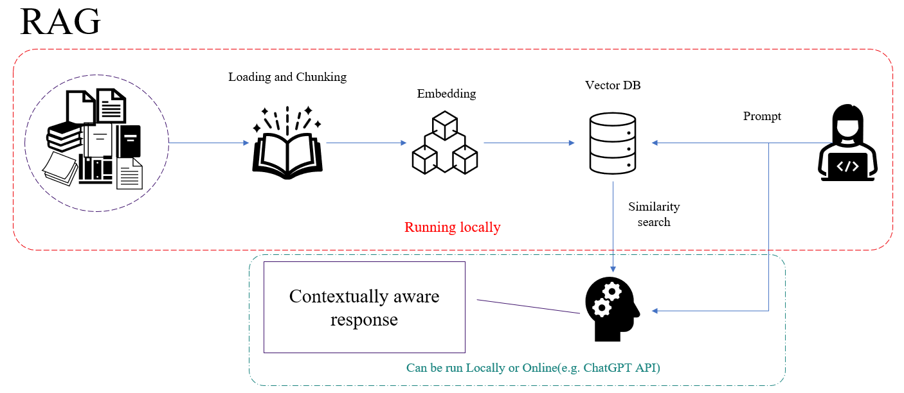

# RAG
This is a vanilla PDF RAG implementation using local LLM.

Retrieval-Augmented Generation (RAG) is an advanced approach that combines retrieval-based methods with generative models to enhance natural language understanding and response generation. This technique is designed to improve the quality and relevance of generated responses by integrating external information retrieval with the generative capabilities of models like GPT (Generative Pre-trained Transformer).

**Advantages of RAG**

*Enhanced Accuracy*: By leveraging external information, RAG can produce more accurate and relevant responses compared to models relying solely on their pre-trained knowledge.

*Contextual Relevance*: The integration of retrieval and generation allows for responses that are better aligned with the specific details of the query.

*Adaptability*: RAG models can be fine-tuned with specific datasets to cater to particular domains or topics.

## Usage 
1. Install requirements
    ```
    pip install -r requirements.txt
    ```
2. Model weights needs to be loaded in Model directory
3. Pdf files to be placed in data directory
4. 	Initialise database creater for first time :
	```
    python database_creator.py 
    ```
    Parameters **chunk_size** and **chunk_overlap** needs to be carefully selcted based on results and data being used.

5. This creates a local db in FAISS under directory *faiss_index*
6. Make sure the required parameters are changed based on the requirement in main.py.
    
    N.B:

    *a.)* model_path update with the model used
    
    *b.)* n_gpu_layers when set to -1 all the weights are offloaded to GPU. We can control it to implement partial offloads to GPU and CPU.


```
def load_model():
    # Define the LLM Model
    n_gpu_layers = -1
    n_batch = 500
    context_len = 2048
    callback_manager = CallbackManager([StreamingStdOutCallbackHandler()])
    llm = LlamaCpp(
        model_path="Model/zephyr-7b-beta.Q4_0.gguf",
        temperature=0.1,
        max_tokens=2000,
        n_gpu_layers=n_gpu_layers,
        n_ctx=context_len,
        n_batch=n_batch,
        callback_manager=callback_manager,
        verbose=True,  # Verbose is required to pass to the callback manager
    )
    return llm
```
7. Once all is done run the app:
    ```
    streamlit run main.py
    ```